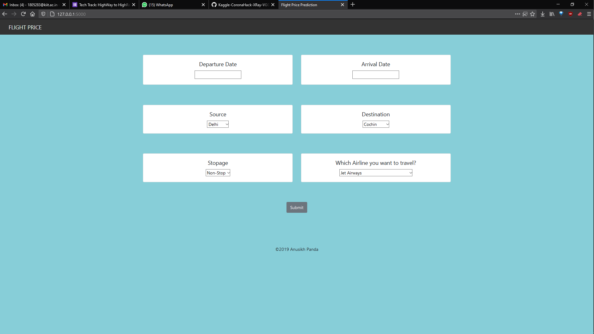

# Flight-Price-Prediction

Web App to predict the approx. price of flight tickets connecting the major cities in India.

 - Its uses Machine Learning to predict the possble prices of a flight on a particular date.
 - Python Flask has been used for the back-end and HTML, CSS, Bootstrap has been used for the front-end.
 
 
